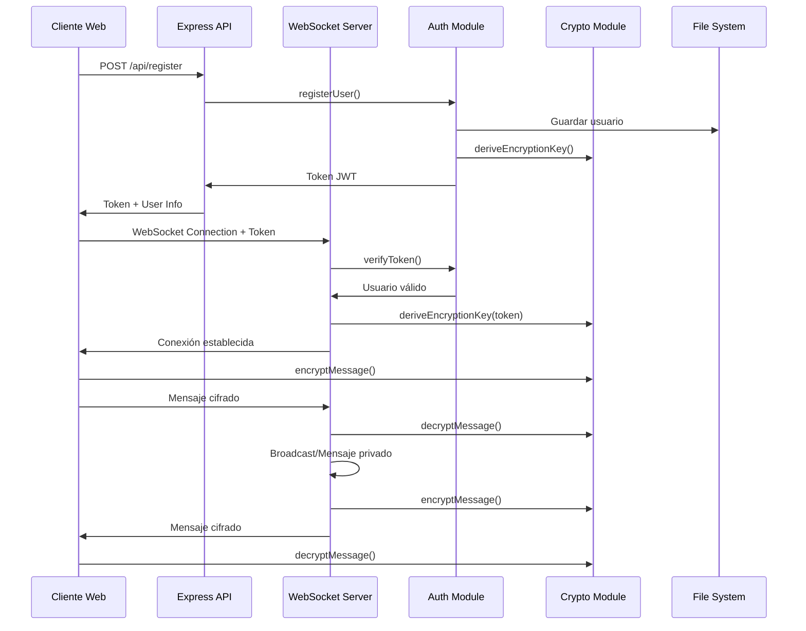

# Chat Distribuido Seguro en Node.js

**Trabajo Práctico Final – Programación sobre Redes**

Sistema de chat en tiempo real con autenticación JWT, cifrado end-to-end y comunicación bidireccional mediante WebSockets.

---

## 📋 Tabla de Contenidos

1. [Descripción General](#descripción-general)
2. [Características Principales](#características-principales)
3. [Arquitectura del Sistema](#arquitectura-del-sistema)
4. [Migración de TCP a WebSockets](#migración-de-tcp-a-websockets)
5. [Cliente Web](#cliente-web)
6. [Autenticación con JWT](#autenticación-con-jwt)
7. [Cifrado de Mensajes](#cifrado-de-mensajes)
8. [Sistema de Logging](#sistema-de-logging)
9. [Manejo de Desconexiones y Reconexiones](#manejo-de-desconexiones-y-reconexiones)
10. [Instalación y Configuración](#instalación-y-configuración)
11. [Uso del Sistema](#uso-del-sistema)
12. [Consideraciones de Seguridad](#consideraciones-de-seguridad)

---

## 🎯 Descripción General

Este proyecto implementa un sistema de chat distribuido seguro que permite comunicación en tiempo real entre múltiples usuarios. El sistema utiliza WebSockets para comunicación bidireccional, autenticación basada en JWT (JSON Web Tokens) y cifrado AES-256-GCM para proteger los mensajes en tránsito.

### Tecnologías Utilizadas

- **Backend**: Node.js con Express
- **WebSockets**: Biblioteca `ws` para comunicación en tiempo real
- **Autenticación**: JWT (jsonwebtoken)
- **Cifrado**: AES-256-GCM con derivación de clave PBKDF2
- **Frontend**: HTML5, CSS3, JavaScript (ES6+)
- **Almacenamiento**: Sistema de archivos JSON para usuarios

---

## ✨ Características Principales

- ✅ **Comunicación en Tiempo Real**: WebSockets para mensajería instantánea
- ✅ **Autenticación Segura**: Sistema de registro y login con JWT
- ✅ **Cifrado End-to-End**: Mensajes cifrados con AES-256-GCM
- ✅ **Chat Público y Privado**: Comunicación grupal e individual
- ✅ **Múltiples Usuarios**: Soporte concurrente para múltiples conexiones
- ✅ **Logging Completo**: Registro de eventos, conexiones y errores
- ✅ **Reconexión Automática**: Recuperación automática ante desconexiones
- ✅ **Interfaz Web Moderna**: Cliente web responsive y fácil de usar

---

## 🏗️ Arquitectura del Sistema

### Diagrama de Componentes

```
┌─────────────────────────────────────────────────────────────┐
│                        CLIENTE WEB                           │
│  ┌──────────────┐  ┌──────────────┐  ┌──────────────┐      │
│  │   HTML/CSS   │  │  JavaScript  │  │ Web Crypto   │      │
│  │  (UI/UX)     │  │  (Cliente)   │  │   API        │      │
│  └──────────────┘  └──────────────┘  └──────────────┘      │
│         │                 │                 │               │
│         └─────────────────┼─────────────────┘               │
│                           │                                   │
│                    WebSocket (WSS/WS)                        │
│                           │                                   │
└───────────────────────────┼───────────────────────────────────┘
                            │
                            ▼
┌─────────────────────────────────────────────────────────────┐
│                    SERVIDOR NODE.JS                          │
│  ┌──────────────┐  ┌──────────────┐  ┌──────────────┐      │
│  │   Express    │  │  WebSocket   │  │   Crypto     │      │
│  │  (HTTP API)  │  │   Server     │  │  (Node.js)   │      │
│  └──────────────┘  └──────────────┘  └──────────────┘      │
│         │                 │                 │               │
│         └─────────────────┼─────────────────┘               │
│                           │                                   │
│         ┌─────────────────┼─────────────────┐                │
│         │                 │                 │                │
│  ┌──────▼──────┐  ┌──────▼──────┐  ┌──────▼──────┐         │
│  │   Auth      │  │  Message    │  │   Logging   │         │
│  │  Module     │  │  Handler    │  │   System    │         │
│  │  (JWT)      │  │  (Broadcast)│  │  (Winston)   │         │
│  └─────────────┘  └─────────────┘  └─────────────┘          │
│         │                 │                 │                │
│         └─────────────────┼─────────────────┘                │
│                           │                                    │
│                    ┌──────▼──────┐                            │
│                    │  File System │                            │
│                    │  (users.json)│                            │
│                    │  (logs/)     │                            │
│                    └─────────────┘                            │
└───────────────────────────────────────────────────────────────┘
```

### Flujo de Datos



---

## 🔄 Migración de TCP a WebSockets

### Contexto Inicial

El proyecto comenzó con una implementación basada en sockets TCP tradicionales (`net` module de Node.js), similar a los ejemplos de clase (`class01-server1.js`, `enhanced-server.js`). Esta implementación funcionaba bien para clientes de línea de comandos pero tenía limitaciones para aplicaciones web.

### Ventajas del Cambio a WebSockets

#### 1. **Compatibilidad con Navegadores**
- Los sockets TCP no son accesibles directamente desde navegadores web
- WebSockets es un estándar web (RFC 6455) soportado nativamente por todos los navegadores modernos
- No requiere plugins adicionales o aplicaciones cliente

#### 2. **Comunicación Bidireccional en Tiempo Real**
- **TCP**: Requiere mantener conexiones persistentes y manejar buffers manualmente
- **WebSocket**: Protocolo full-duplex nativo, ideal para aplicaciones en tiempo real
- Reducción de overhead comparado con polling HTTP

#### 3. **Integración con HTTP**
- WebSockets inician como conexiones HTTP y se "upgradean" al protocolo WebSocket
- Permite servir archivos estáticos (HTML, CSS, JS) desde el mismo servidor
- Facilita el desarrollo de aplicaciones web monolíticas

#### 4. **Manejo de Errores y Reconexión**
- WebSockets proporcionan eventos nativos (`onclose`, `onerror`)
- Más fácil implementar lógica de reconexión automática
- Mejor integración con el ciclo de vida de aplicaciones web

### Implementación de la Migración

#### Integración de WebSocket en el Servidor

```javascript
// Antes: TCP Server
const server = net.createServer((socket) => {
  socket.on('data', (data) => {
    // Procesar datos TCP
  });
});

// Después: WebSocket Server
import { WebSocketServer } from 'ws';
import http from 'http';
import express from 'express';

const app = express();
const server = http.createServer(app);
const wss = new WebSocketServer({ server });

wss.on('connection', (ws, req) => {
  ws.on('message', (data) => {
    // Procesar mensajes WebSocket
  });
});
```

#### Manejo de Comunicación Bidireccional

**TCP (Implementación Anterior)**:
```javascript
// Envío de datos
socket.write('mensaje\n');

// Recepción de datos
socket.on('data', (data) => {
  const message = data.toString().trim();
  // Procesar mensaje
});
```

**WebSocket (Implementación Actual)**:
```javascript
// Envío de datos (JSON estructurado)
ws.send(JSON.stringify({
  type: 'message',
  data: { nickname, message, timestamp }
}));

// Recepción de datos
ws.on('message', (data) => {
  const parsed = JSON.parse(data.toString());
  // Procesar mensaje estructurado
});
```

#### Consideraciones para la Interacción Web

1. **Formato de Mensajes**: Migración de texto plano a JSON estructurado
2. **Manejo de Eventos**: Uso de eventos del navegador (`onopen`, `onmessage`, `onclose`)
3. **CORS y Seguridad**: WebSockets respetan políticas de origen del navegador
4. **Persistencia de Estado**: Uso de `localStorage` para tokens y estado del cliente

---

## 🌐 Cliente Web

### Arquitectura del Cliente

El cliente web está implementado como una Single Page Application (SPA) que se comunica directamente con el servidor WebSocket.

#### Estructura de Archivos

```
public/
├── index.html      # Estructura HTML principal
├── style.css       # Estilos y diseño responsive
├── client.js       # Lógica del cliente WebSocket
└── crypto-client.js # Módulo de cifrado (Web Crypto API)
```

### Conexión de Múltiples Clientes

El servidor mantiene un `Map` de conexiones activas:

```javascript
// Servidor
const clients = new Map(); // Map<WebSocket, ClientInfo>

wss.on('connection', (ws, req) => {
  const client = {
    id: clientId,
    userId: user.id,
    username: user.username,
    nickname: user.nickname,
    token: token,
    encryptionKey: encryptionKey,
    connectedAt: new Date()
  };
  
  clients.set(ws, client);
});
```

Cada cliente se identifica mediante:
- **Token JWT**: Autenticación y autorización
- **WebSocket Connection**: Canal de comunicación único
- **Clave de Cifrado**: Derivada del token para seguridad

### Flujo de Envío y Recepción de Mensajes

#### Envío de Mensaje

```javascript
// 1. Usuario escribe mensaje en el input
// 2. Cliente verifica token y cifra mensaje
async sendEncryptedMessage(content, type = 'message') {
  const encryptedContent = await encryptMessage(content, this.encryptionKey);
  
  const messageData = {
    type: type,
    token: this.token,
    encrypted: true,
    content: encryptedContent
  };
  
  this.ws.send(JSON.stringify(messageData));
}

// 3. Servidor recibe, descifra y procesa
ws.on('message', (data) => {
  const parsed = JSON.parse(data.toString());
  const decrypted = decryptMessage(parsed.content, client.encryptionKey);
  // Broadcast o mensaje privado
});
```

#### Recepción de Mensaje

```javascript
// Cliente recibe mensaje cifrado
ws.onmessage = async (event) => {
  const data = JSON.parse(event.data);
  
  if (data.encrypted) {
    const decrypted = await decryptMessage(data.data, this.encryptionKey);
    data.data = JSON.parse(decrypted);
  }
  
  this.handleMessage(data); // Mostrar en UI
};
```

### Características del Cliente

- **Interfaz Responsive**: Adaptable a diferentes tamaños de pantalla
- **Autenticación Integrada**: Modal de login/registro
- **Chat Público y Privado**: Tabs para cambiar entre modos
- **Lista de Usuarios en Tiempo Real**: Sidebar con usuarios conectados
- **Notificaciones Visuales**: Indicadores de estado y mensajes del sistema

---

## 🔐 Autenticación con JWT

### Flujo de Autenticación

#### 1. Registro de Usuario

```javascript
// Cliente: POST /api/register
{
  username: "usuario123",
  password: "contraseña",
  nickname: "Mi Nickname" // Opcional
}

// Servidor: auth.js
export function registerUser(username, password, nickname) {
  // Validaciones
  if (users[username]) {
    throw new Error('Usuario ya existe');
  }
  
  // Hash de contraseña (SHA-256)
  const hashedPassword = hashPassword(password);
  
  // Guardar usuario
  users[username] = {
    id: userId,
    username,
    password: hashedPassword,
    nickname: nickname || username,
    createdAt: new Date().toISOString()
  };
  
  // Generar token JWT
  const token = generateToken(user);
  return { user, token };
}
```

#### 2. Login de Usuario

```javascript
// Cliente: POST /api/login
{
  username: "usuario123",
  password: "contraseña"
}

// Servidor: Verificar credenciales
export function authenticateUser(username, password) {
  const user = users[username];
  if (!user || !verifyPassword(password, user.password)) {
    throw new Error('Credenciales inválidas');
  }
  
  return generateToken(user);
}
```

#### 3. Validación del Token en WebSocket

```javascript
// Al conectar WebSocket
wss.on('connection', (ws, req) => {
  // Extraer token de query string o headers
  const url = new URL(req.url, `http://${req.headers.host}`);
  const token = url.searchParams.get('token');
  
  // Verificar token
  try {
    const decoded = verifyToken(token);
    const user = getUserById(decoded.id);
    
    if (!user) {
      ws.close(1008, 'Usuario no encontrado');
      return;
    }
    
    // Conexión autorizada
    // Derivar clave de cifrado del token
    const encryptionKey = deriveEncryptionKey(token);
    
  } catch (error) {
    ws.close(1008, 'Token inválido');
  }
});
```

#### 4. Verificación Continua

El token se verifica en cada mensaje enviado:

```javascript
ws.on('message', (data) => {
  // Verificar token antes de procesar
  if (!verifyClientToken(ws)) {
    logoutClient(ws, 'Token inválido o expirado');
    return;
  }
  
  // Procesar mensaje...
});
```

### Ejemplo de Handshake + Autenticación

```
1. Cliente → Servidor: POST /api/login
   Body: { username: "user", password: "pass" }

2. Servidor → Cliente: 200 OK
   Body: { 
     success: true,
     token: "eyJhbGciOiJIUzI1NiIsInR5cCI6IkpXVCJ9...",
     user: { id: "...", username: "user", nickname: "User" }
   }

3. Cliente: Almacena token en localStorage

4. Cliente → Servidor: WebSocket Connection
   URL: ws://localhost:8080?token=eyJhbGciOiJIUzI1NiIsInR5cCI6IkpXVCJ9...

5. Servidor: Verifica token, deriva clave de cifrado

6. Servidor → Cliente: WebSocket Open
   Mensaje: { type: 'welcome', data: { message: 'Bienvenido...' } }

7. Cliente ↔ Servidor: Comunicación cifrada bidireccional
```

### Estructura del Token JWT

```javascript
// Payload del token
{
  id: "user_1234567890_abc123",
  username: "usuario123",
  nickname: "Mi Nickname",
  iat: 1234567890,  // Issued at
  exp: 1235173890   // Expiration (7 días)
}
```

---

## 🔒 Cifrado de Mensajes

### Algoritmo Utilizado

El sistema utiliza **AES-256-GCM** (Advanced Encryption Standard con Galois/Counter Mode), un algoritmo de cifrado simétrico que proporciona:

- **Confidencialidad**: Los mensajes no pueden ser leídos sin la clave
- **Autenticación**: Garantiza que el mensaje no ha sido modificado
- **Integridad**: El tag de autenticación previene manipulación

### Derivación de Clave

La clave de cifrado se deriva del token JWT usando **PBKDF2** (Password-Based Key Derivation Function 2):

```javascript
// Servidor: crypto.js
export function deriveEncryptionKey(token) {
  // Salt derivado del hash del token
  const salt = crypto.createHash('sha256').update(token).digest();
  
  // PBKDF2 con 100,000 iteraciones
  const key = crypto.pbkdf2Sync(
    token,           // Password (token)
    salt,            // Salt
    100000,          // Iteraciones
    32,              // Longitud de clave (256 bits)
    'sha256'         // Hash function
  );
  
  return key;
}
```

**Ventajas de esta aproximación**:
- Cada usuario tiene una clave única derivada de su token
- La clave es determinista: mismo token = misma clave
- No requiere intercambio de claves adicional
- El token ya está autenticado, por lo que la clave es confiable

### Proceso de Cifrado

#### En el Cliente (Web Crypto API)

```javascript
// crypto-client.js
export async function encryptMessage(message, key) {
  // 1. Generar IV aleatorio (12 bytes para GCM)
  const iv = crypto.getRandomValues(new Uint8Array(12));
  
  // 2. Convertir mensaje a ArrayBuffer
  const messageBuffer = new TextEncoder().encode(message);
  
  // 3. Cifrar con AES-GCM
  const encrypted = await crypto.subtle.encrypt(
    {
      name: 'AES-GCM',
      iv: iv,
      tagLength: 128 // bits
    },
    key,
    messageBuffer
  );
  
  // 4. Combinar IV + Tag + Ciphertext
  // Formato: [IV (12 bytes)][Tag (16 bytes)][Ciphertext (variable)]
  const combined = new Uint8Array(iv.length + encrypted.byteLength);
  combined.set(iv, 0);
  combined.set(new Uint8Array(encrypted), iv.length);
  
  // 5. Convertir a Base64 para transmisión
  return btoa(String.fromCharCode(...combined));
}
```

#### En el Servidor (Node.js Crypto)

```javascript
// crypto.js
export function encryptMessage(message, key) {
  // 1. Generar IV aleatorio
  const iv = crypto.randomBytes(12);
  
  // 2. Crear cipher
  const cipher = crypto.createCipheriv('aes-256-gcm', key, iv);
  
  // 3. Cifrar mensaje
  let encrypted = cipher.update(message, 'utf8');
  encrypted = Buffer.concat([encrypted, cipher.final()]);
  
  // 4. Obtener tag de autenticación
  const tag = cipher.getAuthTag();
  
  // 5. Combinar componentes
  const result = Buffer.concat([iv, tag, encrypted]);
  
  // 6. Base64 para transmisión
  return result.toString('base64');
}
```

### Proceso de Descifrado

#### En el Cliente

```javascript
export async function decryptMessage(encryptedData, key) {
  // 1. Decodificar Base64
  const combined = Uint8Array.from(atob(encryptedData), c => c.charCodeAt(0));
  
  // 2. Extraer componentes
  const iv = combined.slice(0, 12);
  const tag = combined.slice(12, 28);
  const ciphertext = combined.slice(28);
  
  // 3. Combinar ciphertext + tag para Web Crypto API
  const encrypted = new Uint8Array(ciphertext.length + tag.length);
  encrypted.set(ciphertext, 0);
  encrypted.set(tag, ciphertext.length);
  
  // 4. Descifrar
  const decrypted = await crypto.subtle.decrypt(
    {
      name: 'AES-GCM',
      iv: iv,
      tagLength: 128
    },
    key,
    encrypted
  );
  
  // 5. Convertir a string
  return new TextDecoder().decode(decrypted);
}
```

#### En el Servidor

```javascript
export function decryptMessage(encryptedData, key) {
  // 1. Decodificar Base64
  const data = Buffer.from(encryptedData, 'base64');
  
  // 2. Extraer componentes
  const iv = data.slice(0, 12);
  const tag = data.slice(12, 28);
  const encrypted = data.slice(28);
  
  // 3. Crear decipher
  const decipher = crypto.createDecipheriv('aes-256-gcm', key, iv);
  decipher.setAuthTag(tag);
  
  // 4. Descifrar
  let decrypted = decipher.update(encrypted);
  decrypted = Buffer.concat([decrypted, decipher.final()]);
  
  // 5. Retornar string
  return decrypted.toString('utf8');
}
```

### Flujo Completo de Cifrado

```
┌─────────────┐                    ┌─────────────┐
│   Cliente   │                    │   Servidor   │
└──────┬──────┘                    └──────┬──────┘
       │                                   │
       │ 1. Mensaje: "Hola mundo"         │
       │                                   │
       │ 2. Derivar clave del token       │
       │    deriveEncryptionKey(token)    │
       │                                   │
       │ 3. Cifrar mensaje                │
       │    encryptMessage(msg, key)      │
       │    → Base64: "aGVsbG8gd29ybGQ="  │
       │                                   │
       │ 4. Enviar por WebSocket          │
       ├──────────────────────────────────>│
       │                                   │
       │                                   │ 5. Derivar clave del token
       │                                   │    deriveEncryptionKey(token)
       │                                   │
       │                                   │ 6. Descifrar mensaje
       │                                   │    decryptMessage(encrypted, key)
       │                                   │    → "Hola mundo"
       │                                   │
       │                                   │ 7. Procesar mensaje
       │                                   │    (Broadcast o privado)
       │                                   │
       │                                   │ 8. Cifrar para destinatarios
       │                                   │    encryptMessage(msg, destKey)
       │                                   │
       │ 9. Recibir mensaje cifrado       │
       │<──────────────────────────────────┤
       │                                   │
       │ 10. Descifrar mensaje             │
       │     decryptMessage(encrypted, key)│
       │     → "Hola mundo"                │
       │                                   │
       │ 11. Mostrar en UI                 │
       │                                   │
```

### Seguridad del Cifrado

- **IV Aleatorio**: Cada mensaje usa un IV único, previniendo ataques de análisis de patrones
- **Tag de Autenticación**: GCM incluye un tag que verifica integridad y autenticidad
- **Clave Única por Usuario**: Cada usuario tiene su propia clave derivada del token
- **Transmisión Base64**: Los datos binarios se codifican en Base64 para transmisión segura por WebSocket

---

## 📝 Sistema de Logging

### Implementación

El sistema utiliza un enfoque híbrido de logging:

1. **Logging a Archivo**: Stream de escritura directa a archivo
2. **Logging a Consola**: Output inmediato para desarrollo
3. **Formato Estructurado**: Timestamps ISO 8601 y tipos de evento

### Código de Logging

```javascript
// websocket-server.js
const LOG_FILE = './logs/chat.log';
const logStream = fs.createWriteStream(LOG_FILE, { flags: 'a' });

function logMessage(type, data) {
  const timestamp = new Date().toISOString();
  const logEntry = `[${timestamp}] ${type}: ${data}\n`;
  logStream.write(logEntry);
  console.log(logEntry.trim());
}
```

### Eventos Registrados

| Tipo de Evento | Descripción | Ejemplo |
|---------------|-------------|---------|
| `SERVER_START` | Inicio del servidor | `[2024-01-15T10:00:00Z] SERVER_START: Servidor WebSocket iniciado en puerto 8080` |
| `CONNECT` | Nueva conexión | `[2024-01-15T10:05:23Z] CONNECT: usuario123 (192.168.1.1) se conectó` |
| `DISCONNECT` | Desconexión | `[2024-01-15T10:10:45Z] DISCONNECT: usuario123 se desconectó` |
| `MESSAGE` | Mensaje público | `[2024-01-15T10:12:30Z] MESSAGE: usuario123: Hola a todos` |
| `PRIVATE_MESSAGE` | Mensaje privado | `[2024-01-15T10:13:15Z] PRIVATE_MESSAGE: usuario123 -> usuario456: Mensaje secreto` |
| `COMMAND` | Comando ejecutado | `[2024-01-15T10:14:00Z] COMMAND: usuario123: /nick NuevoNombre` |
| `LOGIN` | Autenticación exitosa | `[2024-01-15T10:05:20Z] LOGIN: Usuario autenticado: usuario123` |
| `REGISTER` | Nuevo registro | `[2024-01-15T10:04:10Z] REGISTER: Nuevo usuario registrado: usuario123` |
| `ERROR` | Error del sistema | `[2024-01-15T10:15:30Z] ERROR: Error procesando mensaje: Token inválido` |
| `TOKEN_VERIFY_ERROR` | Error de token | `[2024-01-15T10:16:00Z] TOKEN_VERIFY_ERROR: Token inválido para usuario123: Token expirado` |
| `DECRYPT_ERROR` | Error de descifrado | `[2024-01-15T10:17:00Z] DECRYPT_ERROR: Error descifrando mensaje de usuario123: Invalid tag` |

### Ubicación de Logs

Los logs se almacenan en:
```
./logs/chat.log
```

El directorio se crea automáticamente si no existe:

```javascript
const logDir = path.dirname(LOG_FILE);
if (!fs.existsSync(logDir)) {
  fs.mkdirSync(logDir, { recursive: true });
}
```

### Librerías Utilizadas

Aunque el proyecto incluye `winston` en las dependencias, la implementación actual utiliza el módulo `fs` nativo de Node.js para logging directo a archivo. Esto proporciona:

- **Simplicidad**: Sin dependencias adicionales
- **Rendimiento**: Escritura directa sin overhead
- **Control**: Formato personalizado y fácil de modificar

**Nota**: Para producción, se recomienda migrar a `winston` para características avanzadas como rotación de logs, niveles de log, y múltiples transportes.

---

## 🔌 Manejo de Desconexiones y Reconexiones

### Estrategia de Detección de Desconexiones

#### En el Servidor

El servidor detecta desconexiones mediante eventos nativos de WebSocket:

```javascript
ws.on('close', () => {
  const client = clients.get(ws);
  if (client) {
    // Notificar a otros usuarios
    broadcast('system', { 
      message: `🔴 ${client.nickname} se ha desconectado` 
    }, ws);
    
    // Eliminar del mapa de clientes
    clients.delete(ws);
    
    // Actualizar lista de usuarios
    broadcast('users', {
      count: clients.size,
      users: getConnectedUsers()
    });
  }
});
```

#### En el Cliente

El cliente detecta desconexiones y errores:

```javascript
ws.onclose = (event) => {
  this.isConnected = false;
  this.updateStatus(false, 'Desconectado');
  
  // Si fue por autenticación, mostrar modal
  if (event.code === 1008) {
    localStorage.removeItem('chat_token');
    this.showAuthModal();
  } else {
    // Intentar reconectar
    this.attemptReconnect();
  }
};

ws.onerror = (error) => {
  console.error('Error WebSocket:', error);
  this.updateStatus(false, 'Error de conexión');
};
```

### Reconexión Automática

El cliente implementa un sistema de reconexión con backoff exponencial:

```javascript
attemptReconnect() {
  if (!this.token) {
    this.showAuthModal();
    return;
  }
  
  if (this.reconnectAttempts < this.maxReconnectAttempts) {
    this.reconnectAttempts++;
    this.addSystemMessage(
      `🔄 Intentando reconectar... (${this.reconnectAttempts}/${this.maxReconnectAttempts})`
    );
    
    setTimeout(() => {
      this.connect(); // Reintentar conexión
    }, this.reconnectDelay);
  } else {
    this.addSystemMessage('❌ Máximo número de intentos alcanzado');
  }
}
```

**Parámetros de Reconexión**:
- `maxReconnectAttempts`: 5 intentos
- `reconnectDelay`: 2000ms (2 segundos)
- Verificación de token antes de reconectar

### Persistencia de Sesión

#### Tokens en localStorage

```javascript
// Al autenticarse
localStorage.setItem('chat_token', token);

// Al verificar al cargar
const savedToken = localStorage.getItem('chat_token');
if (savedToken) {
  await this.verifyToken(savedToken);
  this.connect();
}
```

**Ventajas**:
- El usuario no necesita re-autenticarse si recarga la página
- La sesión persiste entre reconexiones
- El token se valida antes de cada conexión

**Desventajas**:
- Si el token expira, el usuario debe iniciar sesión nuevamente
- No hay sincronización entre múltiples pestañas

### Ping/Pong para Mantener Conexión

El sistema implementa un mecanismo de keep-alive:

```javascript
// Servidor: Ping periódico
const pingInterval = setInterval(() => {
  if (ws.readyState === ws.OPEN) {
    ws.ping();
  } else {
    clearInterval(pingInterval);
  }
}, 30000); // Cada 30 segundos

// Cliente: Responder a pings
ws.onmessage = (event) => {
  if (event.data === 'PONG') {
    return; // Ping recibido
  }
  // Procesar otros mensajes...
};

// Cliente: Enviar pings propios
startPing() {
  this.pingInterval = setInterval(() => {
    if (this.ws && this.ws.readyState === WebSocket.OPEN) {
      this.ws.send('PING');
    }
  }, 30000);
}
```

---

## 🚀 Instalación y Configuración

### Requisitos Previos

- **Node.js**: Versión 18.0.0 o superior
- **npm**: Versión 9.0.0 o superior (incluido con Node.js)

### Instalación

1. **Clonar o descargar el proyecto**

```bash
cd chat_parcial
```

2. **Instalar dependencias**

```bash
npm install
```

3. **Configurar variables de entorno (opcional)**

Crear archivo `.env` en la raíz del proyecto:

```env
PORT_WS=8080
JWT_SECRET=tu_secreto_super_seguro_cambiar_en_produccion
JWT_EXPIRES_IN=7d
```

**Nota**: Si no se proporciona `.env`, se usan valores por defecto.

4. **Iniciar el servidor**

```bash
# Modo producción
npm start

# Modo desarrollo (con auto-reload)
npm run dev
```

El servidor estará disponible en: `http://localhost:8080`

### Estructura de Directorios

```
chat_parcial/
├── data/
│   └── users.json          # Base de datos de usuarios (auto-generado)
├── logs/
│   └── chat.log            # Logs del sistema (auto-generado)
├── public/
│   ├── index.html          # Interfaz web principal
│   ├── style.css           # Estilos CSS
│   ├── client.js           # Cliente WebSocket
│   └── crypto-client.js    # Módulo de cifrado del cliente
├── src/
│   └── server/
│       ├── websocket-server.js  # Servidor principal WebSocket
│       ├── auth.js              # Módulo de autenticación JWT
│       └── crypto.js            # Módulo de cifrado del servidor
├── package.json
├── package-lock.json
└── README.md
```

### Scripts Disponibles

| Script | Comando | Descripción |
|--------|---------|-------------|
| `start` | `npm start` | Inicia el servidor WebSocket |
| `dev` | `npm run dev` | Inicia con nodemon (auto-reload) |
| `server:websocket` | `npm run server:websocket` | Alias para iniciar servidor |

---

## 💻 Uso del Sistema

### Primer Uso

1. **Abrir el navegador** y navegar a `http://localhost:8080`

2. **Registrarse**:
   - Click en "Registrarse"
   - Completar formulario:
     - Usuario: mínimo 3 caracteres
     - Contraseña: mínimo 4 caracteres
     - Nickname: opcional (máximo 20 caracteres)
   - Click en "Registrarse"

3. **Iniciar Sesión** (si ya tienes cuenta):
   - Click en "Iniciar Sesión"
   - Ingresar usuario y contraseña
   - Click en "Iniciar Sesión"

4. **Usar el chat**:
   - Escribir mensajes en el input
   - Ver mensajes de otros usuarios en tiempo real
   - Usar comandos disponibles (ver sección siguiente)

### Comandos Disponibles

| Comando | Descripción | Ejemplo |
|---------|-------------|---------|
| `/help` o `/ayuda` | Mostrar ayuda | `/help` |
| `/nick <nombre>` | Cambiar nickname | `/nick NuevoNombre` |
| `/lista` o `/list` o `/users` | Ver usuarios conectados | `/lista` |
| `/salir` o `/quit` o `/exit` | Cerrar sesión | `/salir` |
| `/clear` | Limpiar mensajes (solo cliente) | `/clear` |

### Chat Privado

1. **Abrir chat privado**:
   - Click en cualquier usuario de la lista del sidebar
   - Se abrirá un modal de chat privado

2. **Enviar mensaje privado**:
   - Escribir mensaje en el input del modal
   - Click en "Enviar" o presionar Enter

3. **Cerrar chat privado**:
   - Click en el botón "✕" o presionar ESC

**Nota**: Los mensajes privados están cifrados y solo son visibles para el remitente y destinatario.

### Interfaz de Usuario

#### Elementos Principales

- **Header**: Título, indicador de estado, botón de salir
- **Sidebar**: Lista de usuarios conectados (clickeable para chat privado)
- **Área de Mensajes**: Chat público con scroll automático
- **Input de Mensaje**: Campo de texto con botón de envío
- **Modal de Autenticación**: Login/Registro
- **Modal de Chat Privado**: Conversación individual

#### Indicadores Visuales

- 🟢 **Verde**: Usuario conectado
- 🔴 **Rojo**: Usuario desconectado
- 💬 **Chat privado**: Mensajes privados
- 👥 **Usuarios**: Lista de conectados
- 🔐 **Candado**: Autenticación requerida

---

## 🔒 Consideraciones de Seguridad

### Fortalezas del Sistema

1. **Autenticación JWT**:
   - Tokens firmados con secreto
   - Expiración configurable (7 días por defecto)
   - Verificación en cada conexión y mensaje

2. **Cifrado End-to-End**:
   - AES-256-GCM para confidencialidad e integridad
   - Clave única por usuario derivada del token
   - IV aleatorio para cada mensaje

3. **Validación de Token Continua**:
   - Verificación en cada mensaje enviado
   - Desconexión automática si el token es inválido
   - Verificación en localStorage antes de enviar

4. **Hash de Contraseñas**:
   - SHA-256 para almacenamiento (mejorable a bcrypt)
   - Contraseñas nunca se transmiten en texto plano

### Limitaciones y Recomendaciones

#### ⚠️ Limitaciones Actuales

1. **Almacenamiento de Usuarios**:
   - Archivo JSON plano (no recomendado para producción)
   - **Recomendación**: Migrar a base de datos (MongoDB, PostgreSQL)

2. **Hash de Contraseñas**:
   - SHA-256 es rápido pero vulnerable a rainbow tables
   - **Recomendación**: Usar bcrypt o Argon2

3. **Secreto JWT**:
   - Valor por defecto inseguro
   - **Recomendación**: Usar variable de entorno fuerte

4. **Cifrado Simétrico**:
   - Misma clave para cifrar y descifrar
   - **Recomendación**: Considerar cifrado asimétrico para mensajes privados

5. **Sin Rate Limiting**:
   - Vulnerable a ataques de fuerza bruta
   - **Recomendación**: Implementar rate limiting en endpoints de autenticación

6. **Logs Contienen Información Sensible**:
   - Mensajes pueden aparecer en logs
   - **Recomendación**: No loguear contenido de mensajes privados

#### ✅ Mejoras Recomendadas

1. **HTTPS/WSS**:
   - Usar WebSocket Secure (WSS) en producción
   - Certificados SSL/TLS para encriptar conexión

2. **Validación de Input**:
   - Sanitizar mensajes para prevenir XSS
   - Validar longitud y formato

3. **Rate Limiting**:
   - Limitar intentos de login
   - Limitar mensajes por segundo

4. **Rotación de Tokens**:
   - Refresh tokens para renovar sesiones
   - Invalidación de tokens al cerrar sesión

5. **Auditoría**:
   - Logs de seguridad
   - Detección de patrones sospechosos

---

## 👥 Autores
**Morganti Leonardo**

**Narvaja Matias**

---
**Trabajo Práctico Final – Programación sobre Redes**

Este proyecto fue desarrollado como trabajo práctico final para la materia de Programación sobre Redes.

### Estructura del Código

El código está organizado de manera modular:

- **`websocket-server.js`**: Servidor principal y lógica de WebSocket
- **`auth.js`**: Módulo de autenticación y gestión de usuarios
- **`crypto.js`**: Módulo de cifrado del servidor
- **`client.js`**: Lógica del cliente web
- **`crypto-client.js`**: Módulo de cifrado del cliente

---

## 📄 Licencia

Este proyecto es parte de un trabajo académico y está destinado únicamente para fines educativos.
